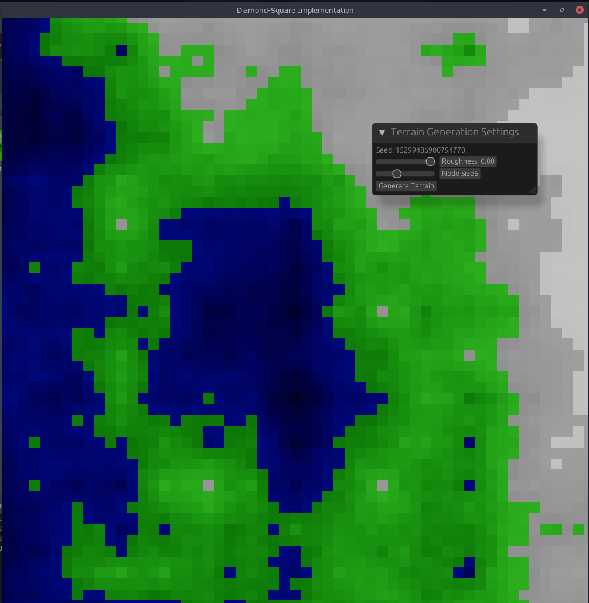
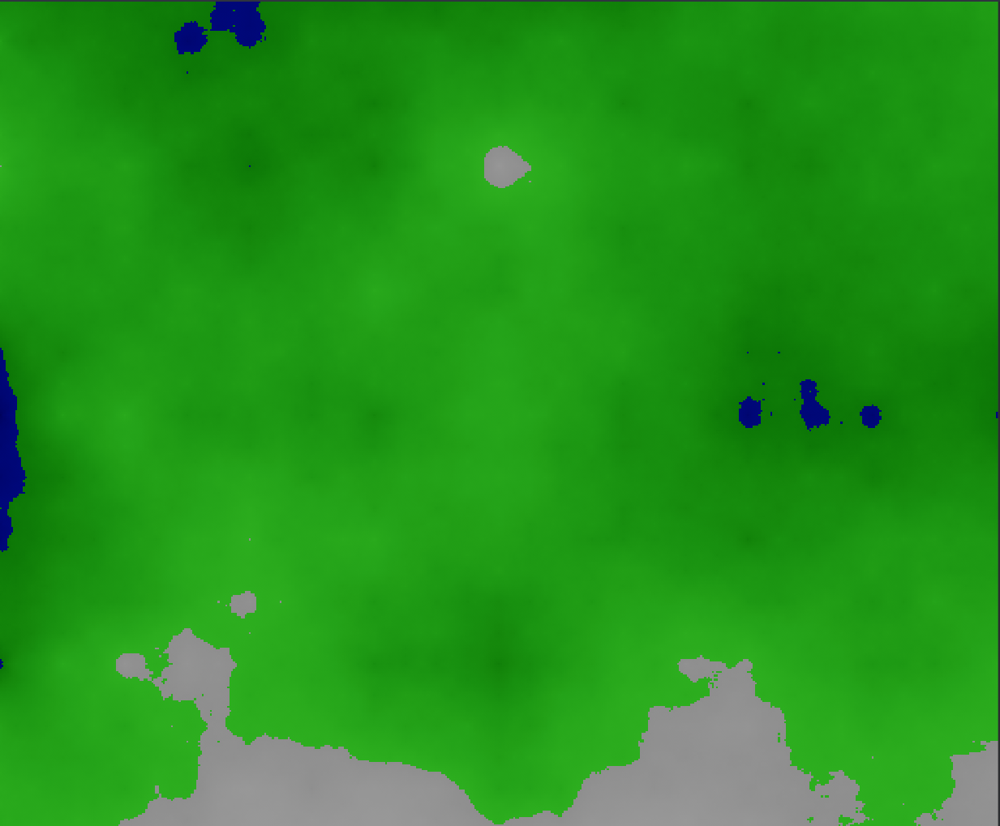
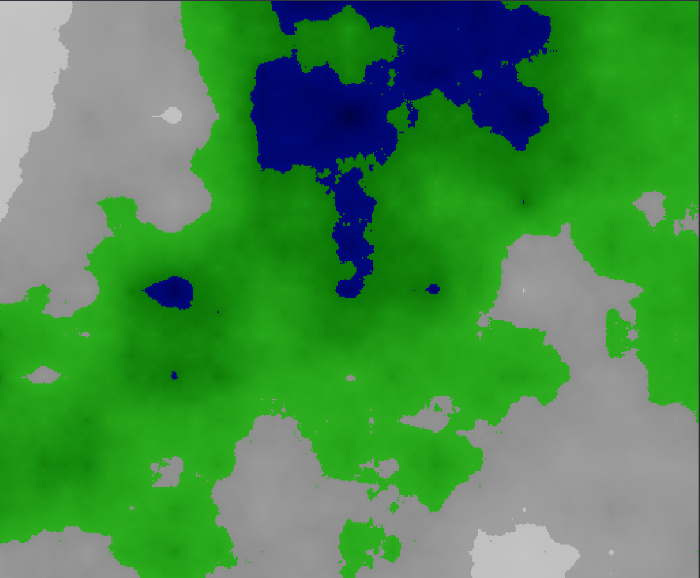

# Diamond-Square

<br>
An implementation of the Diamond-Square Algorithm using the Rust programming language and the [Bevy Engine](https://bevyengine.org/).

## Instructions
1. Clone the repository.
1. Run it with ```cargo run```
1. Enjoy!

## Demo Screenshots

<div style="display: flex; justify-content: space-around;">
  
  
  
  
</div>


